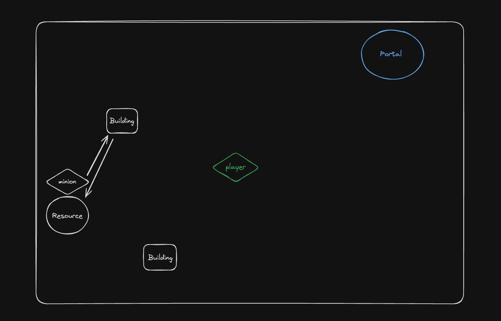
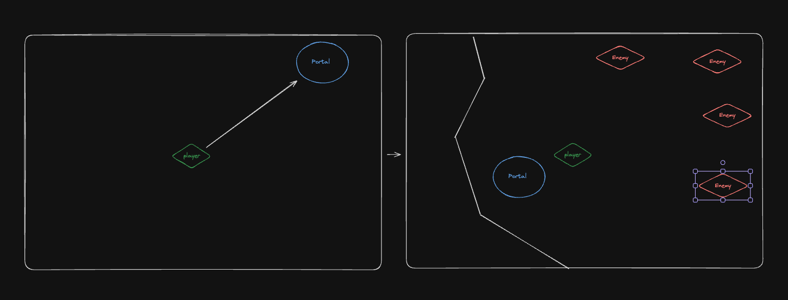
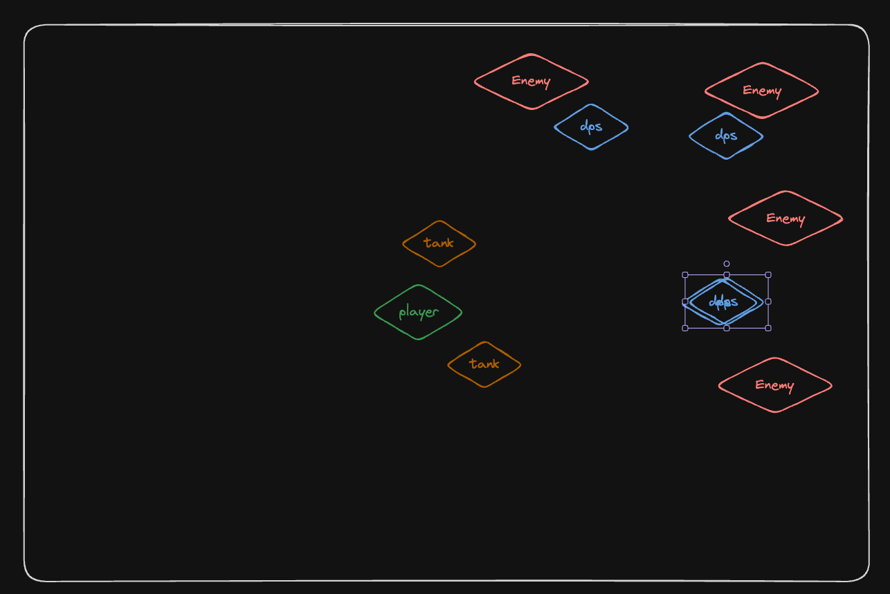

## Features

### Minions gathering resources

Minions should be spawned to gether resources

### Portal to fighting instance

Player should be able to enter portal and access instance where he can fight enemies

### NPC combat system

Player should be able to spawn minions that will fight for player

Initialy:
- Guardian minions (tank)
- Offence minions (dps)

### Building structures

Player should be able to use gathered resources to build structures that would work as powerups and just let progress the game

Initialy:
- Gathering post (to gather resources)
- Minion *asembly?* (to create minions)
- Powerup *totem?* (to grant powerups for player)

### Player combat system

Player should be able to cast abilities that would either buff minions or debuff enemies

